# Intelligent Loan Approval Prediction System

> **AI-powered loan approval prediction system for financial institutions using machine learning**

---

## 📋 Table of Contents

- [Overview](#overview)
- [Features](#features)
- [Data Flow](#data-flow)
    - [Dataset Description](#dataset-description)
    - [Libraries Description](#libraries-description)
- [Modeling Pipeline](#modeling-pipeline)
    - [Model Selection](#model-selection)
    - [Overall Model Overview](#overall-model-overview)
    - [Best Performing Model](#best-performing-model)
- [File Structure](#file-structure)
- [Dependencies](#dependencies)
- [Installation](#installation)
- [Technical Architecture](#technical-architecture)
- [Technical Implementation](#technical-implementation)
- [Model Comparison & Selection](#model-comparison--selection)
- [Deployment](#deployment)
- [Future Enhancements](#future-enhancements)
- [Contributing](#contributing)
- [License](#license)
- [Contact](#contact)

---

## Overview

The **Intelligent Loan Approval Prediction System** is a full-stack web application designed to predict the likelihood of loan approval by analyzing historical applicant data. Using advanced machine learning models, the system captures complex patterns and relationships between features to provide objective, data-driven predictions.

This system empowers financial institutions to:
- Minimize default risk
- Ensure fair and consistent evaluation
- Automate initial loan screening
- Provide transparent decision-making (with SHAP explanations)

---

## Features

- **Search Loan Status:**<br>
Users can search their loan status using a unique 6-digit **Loan ID** to instantly retrieve application details, including:
    - Applicant information
    - Loan amount and status
    - Approval probability
    - Date applied
    - Re-application timeline

- **Rich Interface:**
    - Clean, responsive UI built with Bootstrap
    - Two-step form for loan application (basic info → loan details)
    - Real-time feedback on model predictions
    - Flask-based web interface for end-users and administrators
    - Admin dashboard for monitoring applications with filtering and export capabilities

---

## Data Flow

### Dataset Description
The dataset is collected from Kaggle. Download [Loan Data](https://www.kaggle.com/datasets/altruistdelhite04/loan-prediction-problem-dataset) .
The system uses a cleaned dataset (`CleanedLoanData.csv`) containing applicant attributes such as:
- Demographics: Gender, Marital Status, Dependents, Education, Self-Employment
- Financials: Applicant Income, Co-Applicant Income, Loan Amount, Loan Term
- Credit History and Property Area

The dataset contains the features as follows:

| **Feature Name**           | **Description**                                                                  |
| -------------------------- | -------------------------------------------------------------------------------- |
| **Dependents**             | Number of people financially dependent on the applicant.                         |
| **LoanAmount**             | The total loan amount requested by the applicant (in thousands).                 |
| **CreditHistory**          | Indicates whether the applicant has a valid credit history (1 = good, 0 = poor). |
| **LoanStatus**             | Target variable showing whether the loan was approved (1) or not (0).            |
| **TotalIncome**            | Combined income of the applicant and co-applicant.                               |
| **IncomeLoanRatio**        | Ratio of total income to loan amount, representing repayment capacity.           |
| **LoanTermYears**          | Duration of the loan in years.                                                   |
| **Has_CoApplicantIncome**  | Indicates whether the applicant has a co-applicant contributing to income.       |
| **Gender_Male**            | Indicates if the applicant is male (TRUE = Male, FALSE = Female).                |
| **Married_Yes**            | Indicates if the applicant is married (TRUE = Yes, FALSE = No).                  |
| **Education_NotGraduate**  | Indicates if the applicant is not a graduate.                                    |
| **PropertyArea_Semiurban** | Indicates if the property is located in a semiurban area.                        |
| **PropertyArea_Urban**     | Indicates if the property is located in an urban area.                           |
| **SelfEmployed_Yes**       | Indicates if the applicant is self-employed.                                     |


### Data Preprocessing
- **Sanity Check**
  - Remove duplicates
  - check nulls status
  - standardize features

- **Exploratory Data Analysis**
  - ***Univariate Analysis***: `countplot`, `histplot`, `boxplot` are used to check data distribution and outliers detection.
  - ***Bivariate Analysis***: `scatterplot` for numerical relationship, `stacked barplot` for categorical features vs target features.
  - ***Multivariate Analysis***: `pairplot` for quick overview of numerical relationship, `scatterplot` for feature influences the relationship, grouped bar chart for approval rate combination, `faceted Plot` for multi-dimensional relationships, `heatmap` of correlation matrix.

- **Missing Value Handling**
  - KNN imputation for continuous numerical features
  - Mode Imputation for categorical features

- **Outliers Treatment**
  - Used IQR method

- **Feature Engineering**
  - Created new features
  - Drop redundant features
  - Categorical encoding
  - Fix features naming issues


### Libraries Description
| Library | Purpose |
|---------|---------|
| `pandas`, `numpy` | Data manipulation and analysis |
| `scikit-learn` | Model training, evaluation, and preprocessing |
| `lightgbm`, `xgboost` | Gradient boosting models |
| `tensorflow`, `scikeras` | Neural Network implementation |
| `Flask`, `Flask-Login`, `Flask-WTF` | Web framework, authentication, forms |
| `joblib` | Model persistence |
| `shap` | Model interpretability |
| `gunicorn` | Production server |

---

## Modeling Pipeline

The modeling pipeline encompasses the complete workflow from data preparation to final model deployment, ensuring reproducibility, robustness, and optimal performance.

**Data Preparation & Feature Engineering**
  - Input: cleaned dataset `CleanedLoanData.csv`
  - Feature-Target Separation: Extract `LoanStatus` as target variable
  - Feature Engineering:
    - `TotalIncome` = Applicant Income + Co-Applicant Income
    - `IncomeLoanRatio` = Total Income / Loan Amount
    - `Has_CoApplicantIncome` = Binary flag for co-applicant presence
    - One-hot encoding for categorical variables (Gender, Married, Education, PropertyArea, SelfEmployed)
  - Train-Test Split: Stratified 80-20 split to maintain class distribution
  - Cross-Validation Setup: 5-fold stratified CV for robust evaluation

**Model Development & Hyperparameter Optimization**

| ***Model***           | ***Optimization Technique***          | ***Key Hyperparameters***                                                               |
| ------------------- | ----------------------------------- | ------------------------------------------------------------------------------------- |
| Logistic Regression | GridSearchCV                        | C, penalty, solver, class_weight                                                      |
| Random Forest       | GridSearchCV                        | n_estimators, max_depth, min_samples_split, class_weight                              |
| XGBoost             | Optuna                              | n_estimators, max_depth, learning_rate, subsample, colsample_bytree, scale_pos_weight |
| LightGBM            | Optuna                              | n_estimators, max_depth, num_leaves, learning_rate, subsample, colsample_bytree       |
| SVC                 | BayesSearchCV                       | C, gamma, kernel, class_weight                                                        |
| Neural Network      | Fixed Architecture + Early Stopping | 2 hidden layers (64, 32 units), dropout (0.3), Adam optimizer                         |

**Model Evaluation Framework**<br>
Each model was evaluated using a comprehensive set of metrics:

- Primary Metrics: AUC-ROC, AUC-PR, F1-Score, Accuracy
- Robustness Assessment: 5-fold cross-validation scores (mean ± std)
- Overfitting Analysis: Gap between training and test performance across all metrics
- Threshold Optimization: F1-score maximization for optimal decision threshold

**Model Selection & Composite Scoring**<br>
A composite scoring system was developed to objectively select the best model:
```bash
Composite Score = (0.3 × CV Mean) + (0.25 × Test AUC-ROC) + (0.25 × Test F1-Score) + (0.1 × Test Accuracy) - (0.05 × Overfitting Gap) - (0.05 × CV Std)
```

This weighted approach prioritizes:

- Robustness (CV Mean - highest weight)
- Discriminative Power (AUC-ROC)
- Balanced Performance (F1-Score)
- Generalization (penalizing overfitting and high variance)

**Modeling Flowchart**

```mermaid
flowchart TD
    %% Data Preparation & Feature Engineering
    A["CleanedLoanData.csv"] --> B["Feature-Target Separation\nLoanStatus = Target"]
    B --> C["Feature Engineering"]
    C --> C1["TotalIncome = Applicant + Co-Applicant Income"]
    C --> C2["IncomeLoanRatio = TotalIncome / Loan Amount"]
    C --> C3["Has_CoApplicantIncome = Binary Flag"]
    C --> C4["One-Hot Encoding:\nGender, Married, Education,\nPropertyArea, SelfEmployed"]
    C1 --> D["Train-Test Split\n80-20 Stratified"]
    C2 --> D
    C3 --> D
    C4 --> D
    D --> E["5-Fold Stratified CV Setup"]

    %% Model Evaluation Framework
    E --> F["Model Evaluation Framework"]
    F --> F1["Primary Metrics:\nAUC-ROC, AUC-PR, F1-Score, Accuracy"]
    F --> F2["Robustness Assessment:\nCV Scores (Mean ± Std)"]
    F --> F3["Overfitting Analysis:\nTrain-Test Performance Gap"]
    F --> F4["Threshold Optimization:\nF1-Score Maximization"]

    %% Model Selection & Composite Scoring
    F1 --> G["Model Selection & Composite Scoring"]
    F2 --> G
    F3 --> G
    F4 --> G
    G --> G1["Robustness: CV Mean (30%)"]
    G --> G2["Discriminative Power: AUC-ROC (25%)"]
    G --> G3["Balanced Performance: F1-Score (25%)"]
    G --> G4["Generalization: Penalty for\nOverfitting & High Variance (20%)"]

    %% Final Model Comparison
    G1 --> H["Final Model Comparison"]
    G2 --> H
    G3 --> H
    G4 --> H

    H --> I["XGBoost (Optuna)\nCOMPOSITE SCORE: 0.869\nAUC-ROC: 0.865\nF1-Score: 0.903\nCV Mean: 0.776\nCV Std: 0.038\nOverfitting Gap: 0.009\nSELECTED MODEL"]
    H --> J["Random Forest (GridSearchCV)\nComposite Score: 0.866\nHighest CV Mean: 0.778\nAUC-ROC: 0.875\nF1-Score: 0.891"]
    H --> K["LightGBM (Optuna)\nComposite Score: 0.860\nLowest CV Std: 0.027\nHigh Stability"]
    H --> L["Neural Network\nComposite Score: 0.838\nHigh Test F1: 0.917\nPoor CV: 0.698 ± 0.091\nHigh Variance"]
    H --> M["SVC (BayesSearchCV)\nComposite Score: 0.720\nPoor CV Mean: 0.478\nNeeds Improvement"]

    %% Styling
    classDef selected fill:#d4edda,stroke:#28a745,color:#155724;
    classDef good fill:#fff3cd,stroke:#ffc107,color:#856404;
    classDef fair fill:#f8d7da,stroke:#dc3545,color:#721c24;

    class I selected
    class J,K good
    class L,M fair
```



### Overall Model Overview
- Among all evaluated models, **XGBoost (Optuna)** achieved the highest composite score (0.869), demonstrating exceptional balance between robustness, performance, and generalization.
- **XGBoost** delivers the highest Test AUC-ROC (0.865), strong Test F1-Score (0.903), and solid Test Accuracy (0.854), indicating excellent discrimination and balanced performance.
- It shows outstanding cross-validation stability with a high CV Mean (0.776) and low CV Standard Deviation (0.038), confirming consistent performance across data splits.
- The model exhibits minimal overfitting with the smallest AUC-ROC gap (0.009) among all models, demonstrating excellent generalization to unseen data.
- **Random Forest (GridSearchCV)** performs competitively (Composite Score: 0.866) with the highest CV Mean (0.778), but slightly lower Test AUC-ROC (0.875 vs 0.865) and F1-Score (0.891 vs 0.903).
- **LightGBM (Optuna)** shows strong performance (Composite Score: 0.860) with the lowest CV Std (0.027), indicating high stability.
- **Neural Network**, despite high test metrics (F1-Score: 0.917), suffers from poor cross-validation performance (CV Mean: 0.698, CV Std: 0.091), indicating high variance and unreliability.
- **SVC (BayesSearchCV)** significantly underperforms (Composite Score: 0.720, CV Mean: 0.478) and requires substantial improvement.

Therefore, **XGBoost (Optuna)** is selected as the final, production-ready model for intelligent loan approval prediction.

### Best Performing Model
Based on a composite scoring system that weighted Cross-Validation Mean, Test Accuracy, Test F1-Score, Test AUC-ROC, while penalizing overfitting gaps and CV standard deviation, **XGBoost (Optuna)** emerged as the superior model:

- **Cross-Validation Mean Score:** 0.776
- **Cross-Validation Standard Deviation:** 0.038
- **Test Accuracy:** 0.854
- **Test Precision:** 0.824
- **Test Recall:** 1.000
- **Test F1-Score:** 0.903
- **Test AUC-ROC:** 0.865
- **Test AUC-PR:** 0.924
- **Overfitting Gap (AUC-ROC):** 0.009
- **Composite Score:** 0.869
- **Overfitting Status:** Low
- **Model Status:** Good

---

## File Structure

```bash
LoanApprovalPredictionSystem/
├── app/
│   ├── __init__.py           ← Flask app factory
│   ├── routes.py             ← Application routes
│   ├── models.py             ← Model loading and prediction logic
│   └── forms.py              ← WTForms for validation
│
├── artifacts/
│   ├── feature-selection/
│   │   ├── cv.pkl
│   │   ├── x_test_scaler.pkl
│   │   ├── x_test.pkl
│   │   ├── x_train_scaler.pkl
│   │   ├── x_train.pkl
│   │   ├── y_test.pkl
│   │   └── y_train.pkl
│   │
│   ├── model-performance/
│   │   ├── a_CrossValidationSummary.csv
│   │   ├── a_ModelsPerformance.csv
│   │   ├── a_ModelsScores.csv
│   │   ├── a_OverfittingAnalysis.csv
│   │   ├── lgbPerformance.csv
│   │   ├── logisticRegressionPerformance.csv
│   │   ├── neuralNetworkPerformance.csv
│   │   ├── randomForestPerformance.csv
│   │   ├── svcPerformance.csv
│   │   └── xgbPerformance.csv
│   │
│   ├── models/
│   │   ├── lightgbm_testProba.npy
│   │   ├── lightgbm.pkl
│   │   ├── logisticRegression_testProba.npy
│   │   ├── logisticRegression.pkl
│   │   ├── neuralNetwork_testProba.npy
│   │   ├── neuralNetwork.pkl
│   │   ├── randomForest_testProba.npy
│   │   ├── randomForest.pkl
│   │   ├── svc_testProba.npy
│   │   ├── svc.pkl
│   │   ├── xgboost_testProba.npy
│   │   └── xgboost.pkl
│
├── data/
│   ├── loan.csv
│   └── CleanedLoanData.csv   ← Input dataset
│
├── instance/
│   └── loan_app.db           ← SQLite database (ephemeral on Render)
│
├── notebooks/
│   ├── data_preparation.ipynb
│   ├── logisticRegression.ipynb
│   ├── randomForest.ipynb
│   ├── svcModel.ipynb
│   ├── xgbModel.ipynb
│   ├── lightgbmModel.ipynb
│   ├── neuralNetworkModel.ipynb
│   └── modelComparison.ipynb
│
├── static/
│   ├── css/
│   │   └── style.css         ← Custom styling
│   └── js/
│       └── script.js         ← JavaScript enhancements
│
├── templates/
│   ├── base.html             ← Base template with navigation
│   ├── index.html            ← Home page (Apply / Admin Login)
│   ├── basic-information.html← User info form
│   ├── apply.html            ← Loan application form
│   ├── result.html           ← Prediction result page
│   ├── admin/
│   │   ├── login.html        ← Admin login form
│   │   └── dashboard.html    ← Admin monitoring dashboard
│   └── loan_status.html      ← Detailed loan status page
│
├── .gitignore
├── LICENSE
├── Procfile                  ← Render deployment configuration
├── README.md                 ← This file
├── requirements.txt          ← Python dependencies
└── run.py                    ← Entry point for Flask app
```

---

## Dependencies

```python
# Core data manipulation and numerical computing
pandas>=1.5.0
numpy>=1.21.0

# Visualization
matplotlib>=3.5.0
seaborn>=0.12.0

# Machine Learning (Scikit-learn ecosystem)
scikit-learn>=1.2.0

# Gradient Boosting
lightgbm>=4.0.0
xgboost>=1.7.0

# Neural Networks (TensorFlow/Keras)
tensorflow>=2.12.0

# Scikeras wrapper for Keras in scikit-learn
scikeras>=0.6.0

# Hyperparameter Optimization
optuna>=3.0.0
scikit-optimize>=0.9.0

# Model Interpretability
shap>=0.42.0

# Fairness and Bias Metrics (optional)
fairlearn>=0.8.0

# Persistence
joblib>=1.2.0

# Web Framework for Deployment
Flask==2.3.3
Flask-SQLAlchemy==3.0.5
Flask-Login==0.6.3
Flask-WTF==1.1.1
gunicorn==21.2.0
email_validator==2.0.0
```

---

## Installation

### Clone the repository
```bash
git clone https://github.com/tshihab07/Intelligent-Loan-Approval-Prediction-System.git
```

```bash
cd loan-approval-prediction-system
```

### Create virtual environment
```bash
python -m venv .venv
source .venv/bin/activate  # Linux/Mac
# .venv\Scripts\activate   # Windows
```

### Install dependencies
```bash
pip install -r requirements.txt
```

### Run the application
```bash
python run.py
```

Visit `http://localhost:5000` in your browser.

---

## Technical Architecture


---

## Technical Implementation

1. **Web Interface**
  - ***Two-Step Form***:
    - Basic Information (Name, Mobile, Address, City, NID)
    - Loan Details (Income, Loan Amount, Term, Credit History, etc.)

  - ***Prediction Result***:
    - Clear “Approved” or “Rejected” status
    - Probability percentage
    - 6-digit Loan ID for tracking

  - ***Admin Dashboard***:
    - View all applications
    - Filter by status
    - Export data as JSON
    - Search by Loan ID

2. **Database & Persistence**
  - ***SQLite*** used for simplicity (ephemeral on Render)
  - Each loan application stored with:
    - Loan ID (6-digit random number)
    - Applicant information
    - Prediction results
    - Timestamp
  - **Admin user**

---

## Future Enhancements
- **Persistent Database:** Migrate to PostgreSQL for data persistence
- **Email Notifications:** Send approval/rejection emails to applicants
- **Advanced Authentication:** Multi-user admin system with role-based access
- **Model Monitoring:** Track model performance drift over time
- **Fairness Analysis:** Implement demographic parity and equalized odds metrics
- **PDF Reports:** Generate downloadable loan approval reports
- **API Endpoints:** REST API for integration with other systems

---

## Contributing

Contributions are welcome! Please feel free to submit a pull request.
- Fork the project.
- Create your feature branch
- Commit changes
- Push
- Open a Pull Request

---

## Contact

E-mail: tushar.shihab13@gmail.com <br>
More Projects: 👉🏿 [Projects](https://github.com/tshihab07?tab=repositories)<br>
LinkedIn: [Tushar Shihab](https://www.linkedin.com/in/tshihab07/)

---

## License

This project is licensed under the [MIT License](LICENSE).